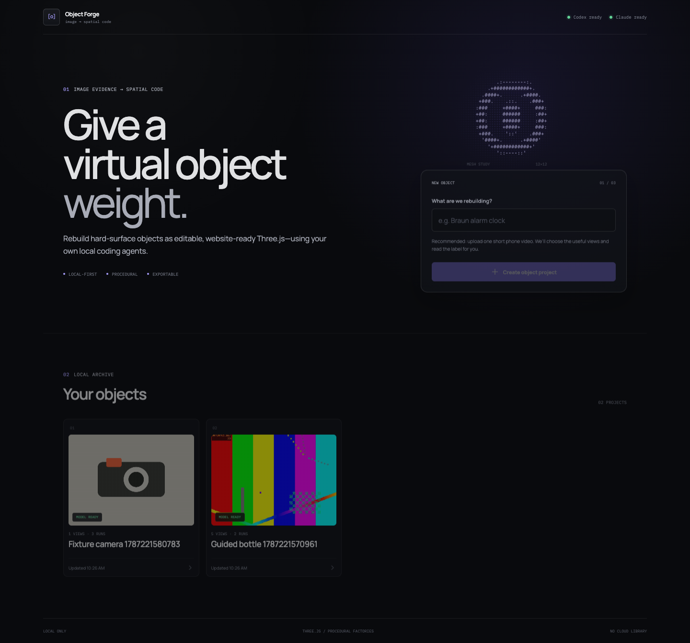
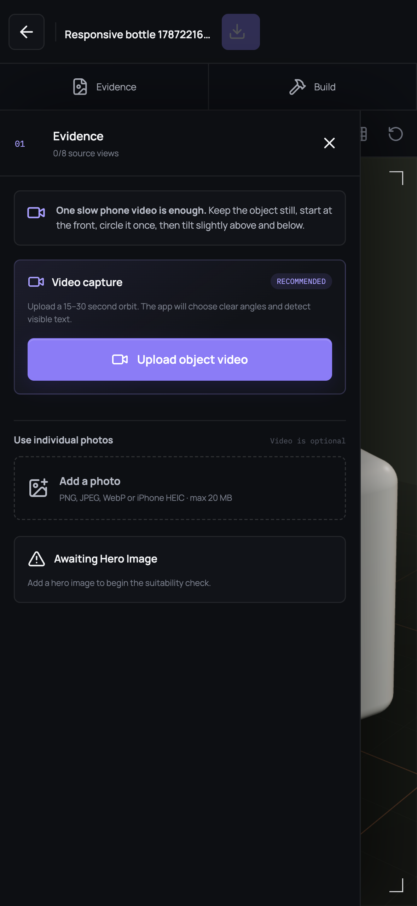
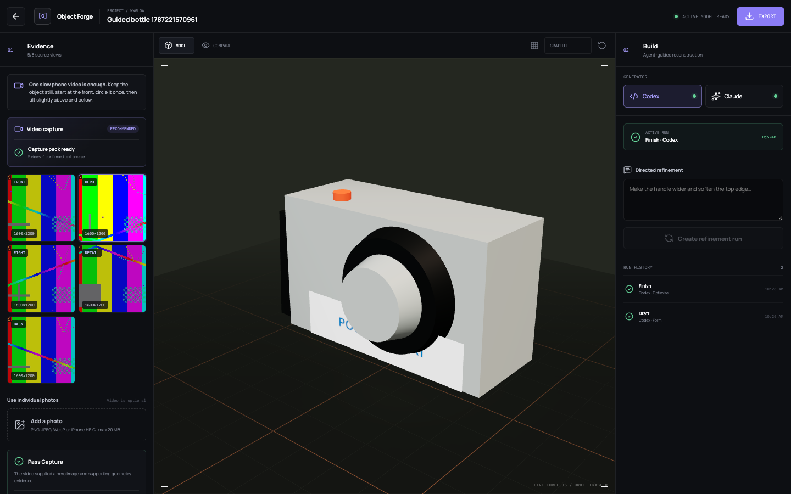

# Object Forge

[](https://github.com/ussumant/object-forge/actions/workflows/ci.yml)

A local, desktop-first image-to-3D creator that turns object videos or photos into editable procedural Three.js code. It is designed for isolated hard-surface products and props: the result is a convincing, website-ready reconstruction, not photogrammetry or exact recovery of unseen geometry.

The application vendors [`hoainho/img2threejs`](https://github.com/hoainho/img2threejs) at commit [`a2907eb`](https://github.com/hoainho/img2threejs/commit/a2907eb5b0d00d6792150948f904eb901dc202c4) and wraps its agent-guided reconstruction process in a persistent creator UI.

## How it works

Create a local object project, upload one slow phone orbit or a set of photos, then inspect and refine the generated Three.js model.



The guided capture works on mobile-sized screens and keeps individual photos available as a first-class alternative.

<p align="center">
  
</p>

After the draft and finish passes succeed, the studio shows the selected evidence, orbitable model, active run, refinement controls, and export action together.



## What v1 includes

- Project library and recoverable run history stored locally under `data/projects/`.
- Recommended MOV, MP4, and WebM intake that extracts and ranks useful views locally, plus PNG, JPEG, WebP, HEIC, and HEIF photo intake.
- Confirmed surface-text evidence and local hybrid decals so packaging words are not silently omitted during finishing.
- Codex and Claude CLI adapters with startup health checks, resumable same-provider sessions, cancellation, event streaming, and a ten-minute inactivity detector.
- Draft, finish, and prompted refinement runs in isolated workspaces.
- Orbitable React Three Fiber preview with reference comparison, wireframe, lighting, background, and camera reset controls.
- Safety scanning, type-aware bundling, preview validation, and stable runtime node metadata for future interactions.
- ZIP export containing a pure Three.js TypeScript factory, React Three Fiber wrapper, vanilla example, sculpt specification, assets, and integration instructions.

## Requirements

- macOS
- Node.js 24 or newer and npm
- Python 3.10 or newer for the vendored reconstruction utilities
- FFmpeg and ffprobe (`brew install ffmpeg`) for video capture packs
- An authenticated `codex` CLI, `claude` CLI, or both
- Google Chrome for Playwright end-to-end tests

The UI reports provider availability and authentication before a run begins. Models are chosen by each CLI; this app does not expose model or cost controls in v1.

## Run locally

```bash
npm install
npm run dev
```

Open [http://127.0.0.1:5173](http://127.0.0.1:5173). The Fastify service runs on port `4057` and Vite proxies `/api` requests to it.

To exercise the full workflow without calling either provider:

```bash
IMG3D_FAKE_PROVIDER=1 npm run dev
```

For a production-style local build:

```bash
npm run build
npm start
```

Then open [http://127.0.0.1:4057](http://127.0.0.1:4057).

## Creator workflow

1. Create a project and upload a 15–30 second phone video of the stationary object.
2. Begin at the front, make one slow orbit, then briefly show higher and lower angles.
3. Review the automatically selected frames and confirm any detected label, logo, or engraving text.
4. Choose **Create 3D model**. The app validates geometry, then continues automatically through materials, confirmed text, and lighting.
5. Orbit and compare the finished model, submit plain-language refinements when useful, and export the active run as a standalone ZIP.

Individual photos remain available as a first-class alternative. A full but incorrect capture pack can be replaced atomically after a new photo passes validation. A one-view reconstruction still requires explicit acknowledgement that hidden geometry will be inferred.

Use evenly lit, sharp images with the whole silhouette visible. Front, back, side, and top views improve geometry; detail views are best for materials and small features. Glass-dominant objects, people, animals, scenes, and manufacturing-grade reconstruction are outside the v1 promise.

## Commands

```bash
npm run typecheck
npm test
npm run test:e2e
npm run build
```

End-to-end tests start isolated fake-provider servers, run against system Chrome, verify the complete upload-to-export path, and capture desktop and mobile screenshots under the ignored `output/playwright/` directory.

## Architecture and safety

The npm workspace contains:

- `apps/web`: React, Vite, React Three Fiber creator studio.
- `apps/server`: Fastify API, filesystem persistence, provider processes, SSE, validation, and ZIP export.
- `packages/shared`: cross-process data contracts.
- `vendor/img2threejs`: pinned upstream pipeline used inside isolated per-run workspaces.

Every run has its own workspace. Providers receive the photos, previous successful artifacts when applicable, the pinned pipeline instructions, and a narrow output contract. Failed, canceled, and `needs_input` runs never replace the active model. Switching providers seeds a new run from the active artifacts; it does not transfer a proprietary provider session.

Before preview or export, generated code is rejected if it uses unapproved imports, network access, external URLs, dynamic execution, Node APIs, unsafe HTML writes, dynamic imports, or path traversal. The server then bundles the factory and the browser checks it in the actual Three.js viewer.

Generated model roots expose `root.userData.sculptRuntime`, and meaningful parts should use stable names, pivots, and sockets. Those contracts prepare for clickable controls and video surfaces without implementing v2 behavior yet.

## Local data

Projects, source videos, extracted frames, references, confirmed text, run logs, workspaces, generated artifacts, provider session identifiers, and activation state live in the gitignored `data/projects/` tree. Source videos and full photographs are never exported. A confirmed local label crop is included only when the generated model explicitly uses it.

The app is intentionally local-only in v1: there are no accounts, billing, collaboration, public hosting, GLB export, or cloud persistence.

## Contributing

Bug reports and focused pull requests are welcome. Read [CONTRIBUTING.md](CONTRIBUTING.md) before changing the reconstruction pipeline, provider process boundary, or generated-code safety rules.

Routine tests use deterministic fake provider adapters and do not spend authenticated Codex or Claude usage. Live provider smoke runs must always be started deliberately.

## License and attribution

Object Forge is available under the [MIT License](LICENSE).

The repository vendors `img2threejs` at the pinned commit linked above. That snapshot retains its original MIT license in [`vendor/img2threejs/LICENSE`](vendor/img2threejs/LICENSE). See [THIRD_PARTY_NOTICES.md](THIRD_PARTY_NOTICES.md) for attribution and upgrade guidance.
